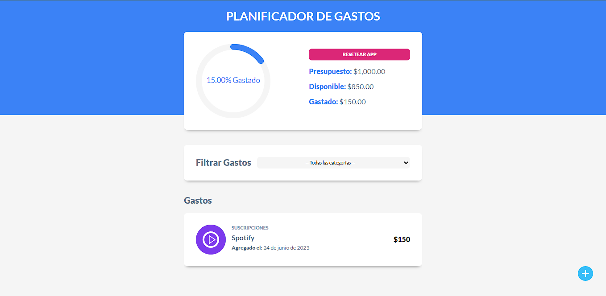

# Control de Gastos

Deploy: https://controldegastos-ev.netlify.app/ </br>
Es una app de tipo CRUD con la finalidad de permitir al usuario agregar sus gastos mensuales y ver un balance básico de estos.

<div>
<p style = 'text-align:center;'>

</p>
</div>

Para poder descargar el proyecto debes:

Clonar el repositorio en tu computadora

```
git clone https://github.com/emavalente/control-gastos-react.git
```

instalar las dependencias del proyecto.

```
npm install
```

Correr el servidor de desarrollo.

```
npm run dev
```
